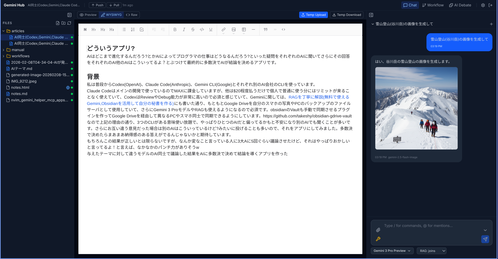
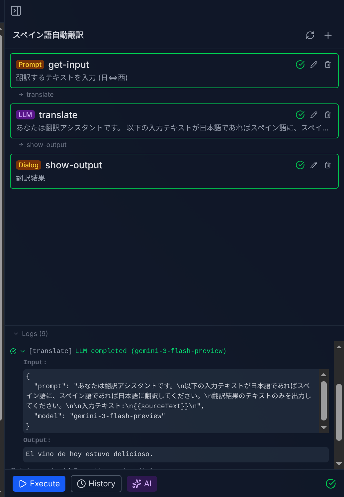

# GemiHub

**Gemini と Google Drive で作る、あなた専用のAI秘書。**

GemiHub は、Google Gemini を Google Drive と深く統合したセルフホスト対応の Web アプリケーションです。AI があなたのファイルを読み・検索し・書き込める。ビジュアルエディタでワークフローを自動化できる。すべてのデータはあなた自身の Google Drive に保存され、外部データベースは不要です。

[English README](./README.md)



## GemiHub でできること

### あなたのデータを理解する AI

一般的な AI チャットとは違い、GemiHub はあなたの Google Drive に直接つながります。AI がファイルを読み取り、横断検索し、新規作成や更新まで — すべて自然な会話で行えます。メモの内容を質問したり、ドキュメントの要約を生成したり、ファイル整理を任せたり。

### 単語ではなく「意味」で検索する（RAG）

組み込みの RAG（検索拡張生成）により、Drive ファイルを Gemini のセマンティック検索に同期できます。キーワードの完全一致ではなく、質問の**意味**を理解して、あなたの個人的なナレッジベースから関連情報を見つけ出します。製品マニュアル、議事録、調査資料を保存しておけば、自然な言葉で質問するだけで答えが返ってきます。

### 外部ツールを自由に接続（MCP & プラグイン）

Model Context Protocol（MCP）を通じて、GemiHub は外部サービスと連携できます。Web 検索、データベース、API、MCP 対応サーバーを接続すれば、AI が会話中にこれらのツールを自動的に発見し活用します。さらに**プラグイン**で機能を拡張可能 — GitHub からインストールまたはローカル開発で、カスタムサイドバービュー、スラッシュコマンド、設定パネルを追加できます。

### コード不要のワークフロー自動化

ビジュアルなドラッグ＆ドロップエディタで複雑な自動化パイプラインを構築できます。AI プロンプト、Drive ファイル操作、HTTP リクエスト、ユーザー入力ダイアログなどを連結。ワークフローは YAML で保存され、ループや条件分岐をサポートし、ストリーミングでリアルタイム実行されます。自然言語による AI ワークフロー生成にも対応しています。


### あなたのデータは、あなたの管理下に

チャット履歴、ワークフロー、設定、変更履歴 — すべてのデータは Google Drive の `gemihub/` フォルダに保存されます。独自データベースもベンダーロックインもありません。オプションのハイブリッド暗号化（RSA + AES）で機密ファイルを保護でき、Python 復号スクリプトも提供されているため、暗号化データには常に独立してアクセスできます。

### オフラインでも使える、同期はあなたのペースで

GemiHub はオフラインファーストです。すべてのファイルはブラウザの IndexedDB にキャッシュされるため、インターネット接続がなくても瞬時に表示されます。オフラインでファイルの作成・編集ができ、変更は自動的に追跡されます。オンラインに戻ったら、ワンクリックで Google Drive に Push。同じファイルが別の場所で編集されていた場合はコンフリクトを検出し、どちらのバージョンを残すか選べます（選ばなかった方は自動でバックアップ）。


## スクリーンショット

### ワークフローノード編集

フォームベースの UI でワークフローノードを編集。LLM プロンプト、モデル、Drive ファイル操作などを設定できます。


### ワークフロー実行

ワークフローを実行し、リアルタイムのストリーミング出力と実行ログを確認できます。



### AI ワークフロー生成

自然言語でワークフローを作成・修正。AI が YAML を生成し、ストリーミングプレビューと思考過程を表示します。


### ファイル管理

コンテキストメニューから Drive ファイルを管理 — Web 公開、履歴表示、暗号化、リネーム、ダウンロードなど。


## 機能一覧

- **AI チャット** — Gemini とのストリーミング会話、Function Calling、思考表示、画像生成、ファイル添付
- **スラッシュコマンド** — ユーザー定義の `/コマンド`、テンプレート変数（`{content}`, `{selection}`（ファイルID・位置情報付き））、`@ファイル` メンション（Drive ファイルIDに解決しツール経由でアクセス）、コマンドごとのモデル/ツール設定
- **ビジュアルワークフローエディタ** — ドラッグ＆ドロップのノードベースビルダー（20種以上のノードタイプ）、YAML 入出力、SSE リアルタイム実行
- **AI ワークフロー生成** — 自然言語でワークフローを作成・修正、ストリーミングプレビューと差分表示
- **RAG** — Drive ファイルを Gemini File Search に同期し、コンテキストを考慮した AI 応答を実現
- **MCP** — 外部 MCP サーバーを AI チャットのツールとして接続
- **プラグイン** — GitHub からインストールまたはローカル開発。カスタムビュー、スラッシュコマンド、設定パネルを追加する API を提供
- **Google Drive 連携** — 全データを自分の Drive に保存、外部データベース不要
- **リッチ Markdown エディタ** — wysimark-lite による WYSIWYG ファイル編集
- **オフラインキャッシュ & 同期** — IndexedDB によるオフラインファースト。インターネットなしでファイルを編集し、Push/Pull で Drive と同期。コンフリクトの自動検出と解決（バックアップ付き）
- **暗号化** — チャット履歴・ワークフローログのハイブリッド RSA + AES 暗号化（オプション）
- **変更履歴** — unified diff 形式によるワークフロー・Drive ファイルの変更追跡
- **マルチモデル対応** — Gemini 3, 2.5, Flash, Pro, Lite, Gemma。有料/無料プラン別モデルリスト
- **画像生成** — Gemini 画像モデルで画像を生成
- **多言語対応** — 英語・日本語 UI

## ドキュメント

詳細なドキュメントは [`docs/`](./docs/) ディレクトリにあります:

| トピック | English | 日本語 |
|---------|---------|--------|
| チャット & AI | [chat.md](./docs/chat.md) | [chat_ja.md](./docs/chat_ja.md) |
| 同期 & オフラインキャッシュ | [sync.md](./docs/sync.md) | [sync_ja.md](./docs/sync_ja.md) |
| ワークフローノードリファレンス | [workflow_nodes.md](./docs/workflow_nodes.md) | [workflow_nodes_ja.md](./docs/workflow_nodes_ja.md) |
| RAG | [rag.md](./docs/rag.md) | [rag_ja.md](./docs/rag_ja.md) |
| MCP | [mcp.md](./docs/mcp.md) | [mcp_ja.md](./docs/mcp_ja.md) |
| 暗号化 | [encryption.md](./docs/encryption.md) | [encryption_ja.md](./docs/encryption_ja.md) |
| プラグイン | [plugins.md](./docs/plugins.md) | [plugins_ja.md](./docs/plugins_ja.md) |
| インフラストラクチャ | [infrastructure.md](./docs/infrastructure.md) | [infrastructure_ja.md](./docs/infrastructure_ja.md) |
| エディタ | [editor.md](./docs/editor.md) | [editor_ja.md](./docs/editor_ja.md) |

## はじめかた

### 前提条件

- Node.js 22 以上
- Google Cloud プロジェクト（下記手順で設定）
- Gemini API キー

### 1. Google Cloud の設定

[Google Cloud Console](https://console.cloud.google.com/) で以下を行います。

#### プロジェクト作成
1. 左上「プロジェクトを選択」→「新しいプロジェクト」→ 名前を付けて作成

#### Google Drive API を有効化
1. 「API とサービス」→「ライブラリ」
2. "Google Drive API" を検索して「有効にする」

#### OAuth 同意画面の設定
1. 「API とサービス」→「OAuth 同意画面」
2. User Type: **外部** を選択
3. アプリ名（例: GemiHub）、ユーザーサポートメール、デベロッパー連絡先を入力
4. スコープ追加: `https://www.googleapis.com/auth/drive.file`
5. テストユーザーに自分の Gmail アドレスを追加（公開前は自分しかアクセスできません）

> **重要: Google Drive のファイルアクセスについて**
>
> このアプリは `drive.file` スコープを使用しており、**アプリ自身が作成したファイルにのみアクセスできます**。Google Drive の Web UI や他のアプリから `gemihub/` フォルダに直接アップロードしたファイルは GemiHub からは**見えません**。ファイルを追加するには、アプリ内のアップロード機能を使用するか、AI チャット経由で作成してください。

#### OAuth 認証情報の作成
1. 「API とサービス」→「認証情報」→「＋認証情報を作成」→「OAuth クライアント ID」
2. アプリケーションの種類: **ウェブアプリケーション**
3. 名前: 任意（例: GemiHub Local）
4. **承認済みリダイレクト URI** に追加: `http://localhost:8132/auth/google/callback`
5. 作成後、**クライアント ID** と **クライアントシークレット** をメモ

### 2. Gemini API キーの取得

1. [Google AI Studio](https://aistudio.google.com/) にアクセス
2. 左メニュー「API キー」→「API キーを作成」
3. キーをメモ（あとでアプリの設定画面から入力します）

> **無料 API の制限:** Gemini API の無料枠はレート制限が厳しく、利用できるモデルも限られています。お試しには十分ですが、日常的な利用には不十分です。本格的に使うには有料プランが必要です。[Google AI Pro](https://one.google.com/about/ai-premium)（$19.99/月）がおすすめです。月 $10 の Google Cloud クレジットが付属し、Gemini API を十分にカバーできるほか、2 TB Google One ストレージや Gemini Code Assist なども含まれます。詳細は [Gemini API Pricing](https://ai.google.dev/pricing) を参照してください。

### 3. クローンとインストール

```bash
git clone <repository-url>
cd gemihub
npm install
```

### 4. 環境変数の設定

```bash
cp .env.example .env
```

`.env` を編集:

```env
GOOGLE_CLIENT_ID=your-client-id.apps.googleusercontent.com
GOOGLE_CLIENT_SECRET=GOCSPX-your-client-secret
GOOGLE_REDIRECT_URI=http://localhost:8132/auth/google/callback
SESSION_SECRET=<ランダム文字列>
```

`SESSION_SECRET` の生成:

```bash
openssl rand -hex 32
```

### 5. 開発サーバーを起動

```bash
npm run dev
```

### 6. 初回セットアップ

1. ブラウザで `http://localhost:8132` を開く
2. 「Sign in with Google」をクリック → Google アカウントで認証
3. 右上の歯車アイコン（Settings）をクリック
4. **General** タブで Gemini API Key を入力して Save

チャット、ワークフロー作成、ファイル編集が使えるようになります。

> **Note:** 開発サーバーのポートは `vite.config.ts` で `8132` に設定されています。変更する場合は、設定ファイルと `.env` のリダイレクト URI、Google Cloud Console の承認済みリダイレクト URI も合わせて更新してください。

## 本番環境

### ビルド

```bash
npm run build
npm run start
```

### Docker

```bash
docker build -t gemihub .
docker run -p 8080:8080 \
  -e GOOGLE_CLIENT_ID=... \
  -e GOOGLE_CLIENT_SECRET=... \
  -e GOOGLE_REDIRECT_URI=https://your-domain/auth/google/callback \
  -e SESSION_SECRET=... \
  gemihub
```

## アーキテクチャ

| レイヤー | 技術 |
|---------|------|
| フロントエンド | React 19, React Router 7, Tailwind CSS v4, Mermaid |
| バックエンド | React Router サーバー（SSR + API ルート） |
| AI | Google Gemini API (`@google/genai`) |
| ストレージ | Google Drive API |
| 認証 | Google OAuth 2.0 → セッション Cookie |
| インフラ | Cloud Run, Cloud Build, Artifact Registry, Cloud DNS, Secret Manager, Global HTTPS LB |
| エディタ | wysimark-lite（Slate ベース WYSIWYG） |

## ライセンス

MIT
